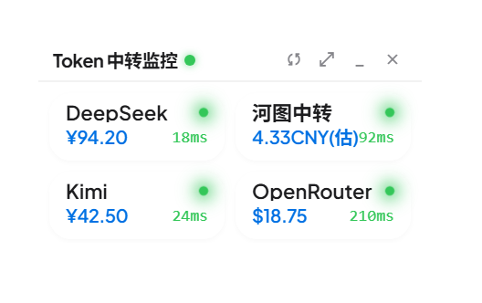
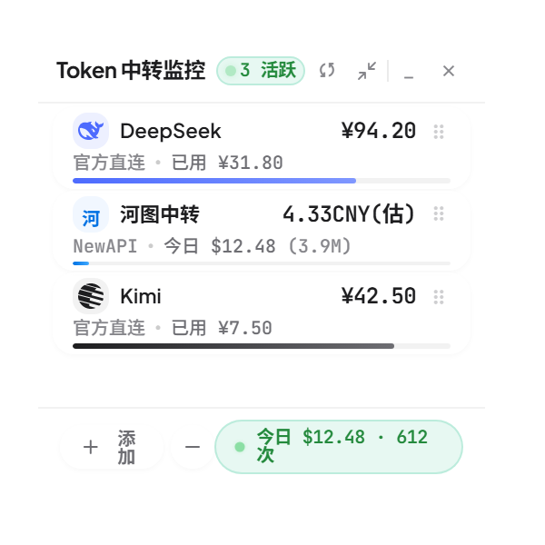

# balance-float 余额/流量浮窗

桌面悬浮窗（pywebview + WebView2，非纯标准库），汇总各 API 账户余额，并展示本机 CC Switch 今日流量。





## 运行

```
启动悬浮窗.vbs            # 唯一启动路径：pythonw -X utf8 float_window.py，监听 127.0.0.1:8765
python -X utf8 float_window.py --check   # 只校验 configs/ 合并后的必填字段，不弹窗
python -X utf8 test_backend.py           # 后端自检（安全/线程/导入，用临时目录，不碰真实 configs/）
python -X utf8 test_ui_page.py           # 接入页静态自检（DOM/页签/尺寸）
python -X utf8 test_ui_page.py --live    # 追加 Chrome 端到端：添加→校验→保存
python -X utf8 test_pages.py             # 组装自检：片段拼回去须与拆分前快照逐字节一致
python -X utf8 theme.py --check          # 主题反查：每个色值对应哪个变量名
python -X utf8 pages.py --write           # 重写 ui/index.html（片段/主题改完后跑一次）
python -X utf8 demo_page.py              # 接入页 demo：起服务 + 浏览器点“添加”进接入页(默认官方接口)
python -X utf8 demo_page.py --real       # 同上，但用真实 configs/（保存/删除会真写盘）
```

配置的合并加载与必填校验（`load_config` / `REQUIRED_FIELDS` / `_check`）都在 `float_window.py` 里，后端只保留这一份口径。窗口置顶，每 `refresh_seconds` 秒后台刷新一次；某行查询失败时保留上一轮成功值继续展示，并带 `stale` 标记与失败时间（`error` 显示最新错误）。展开态底部“添加”进入接入页（见下节），账户的增删改都在页面里完成。

## 接入页（账户配置）

展开态底部“添加”进入，是继收起态、展开态之后的第三个窗口状态：卡片沿用模板配置弹窗的尺寸 360x420
（模板实测 360x423，高度取整），窗口尺寸按卡片上报，不跟随收起/展开态的窗口大小；
列表、表单、设置三态共用这一个窗口大小，装不下的内容由表单区自己滚动，不会把窗口撑高。

页签即账户类型：官方接口 / NewAPI / 自定义（generic）/ CC-SW / OCX，默认停在官方接口。

官方接口页签从上到下是三段：常用服务商选块（DeepSeek / Kimi / GLM，各自带品牌色图标，点一下直接进表单，只需填 API Key，
地址走 providers 里的官方默认值）；主流模型清单（按分类分组，点一行进该模型的标准字段页）；底部是新增按钮。
主流模型的字段表在后端 `configs/official/models.json`：`fields` 定义标准字段的标题/提示/图标，`models` 里每个模型用 `key` 认领
它要哪几个字段，页面按这个顺序铺成「标题行 + 输入行」，值留空由你自己填。加模型或加字段只动这个 json，页面不用改；
页面上的保存只覆盖文件里已声明的键（`POST /api/official/models/save`），你手动加的字段不会被抹掉。这个 json 不参与账户扫描，不会被当成账户。

自定义页签是一个 JSON 文本框，键名以后端为准（name、url、api_key、timeout、headers、json_paths），多的字段原样透传。

| 操作 | 接口 |
| --- | --- |
| 进入页签、列出该类型账户 | GET /api/accounts（凭据掩码） |
| 新增、点行编辑回填 | 掩码值原样回传 = 未改动，后端沿用原值 |
| 测试连接 | POST /api/account/test（凭据可暂缺，只试连通性） |
| 保存并启用 | POST /api/account/save |
| 删除 | POST /api/account/delete |
| 轮询间隔 / 超时 | POST /api/settings（分钟 + 秒，落盘仍为秒） |

列表最下面是固定在滚动区之外的页脚：“导入刷新”气泡 + “一键删除”。CC-SW 仍旧给不了“新增”（节点由扫描导入）；OCX 是要配置的，所以除了导入刷新，列表里还留着“新增 OCX”，表单是「名称 + 服务器连接 + API 密钥」（服务器连接必填，密钥可留空）。
气泡：CC-SW 先 `GET /api/ccsw/scan` 看有没有 cc-switch.db，再 `POST /api/ccsw/import`
导入全部可导入项（features 默认 traffic）；OCX 直接 `POST /api/ocx/import {probe:false}`（读配置即可，不要求代理在线）。导入结果写在页脚状态行。
“导入刷新”一次做完扫描 + 导入 + 节点计数刷新，已配好的节点原地更新，新地址追加。

一键删除与展开页的减号同一套交互：点它进入删除模式，行尾出现勾选圆圈，逐行选中后确认批量删除（`POST /api/account/delete`），不再弹系统确认框。
右上角是向右箭头：列表态退回**展开态**（不是收起态），表单/设置态只退一层回列表，与底部“返回”同义。

## 接口契约

本机 HTTP API（仅监听 127.0.0.1）：

| 方法 | 路径 | 返回 / 说明 |
| --- | --- | --- |
| GET | /api/state | {stations, traffic, loading, updated, accounts, settings}；accounts 只有 {id,name,type}，刻意不含凭据 |
| GET | /api/accounts | 全部账户对象 + file，**凭据字段掩码化**（"••••" + 末 4 位），编辑回填只能走它 |
| GET | /api/ccsw/scan | {available, count, nodes[{provider_id, app_type, name, base_url, has_token}]} |
| GET | /api/ocx/scan | {available, base_url, source, count, nodes[]} 或 {available:false, message, checked[]} |
| GET | /api/ccsw/review | 参数确认清单（scan + 已导入账户 + enabled 计数 + howto） |
| GET | /api/ocx/metrics | OCX 单端口今日合计 + 滚动输出速度曲线（读本地 usage.jsonl） |
| GET | /api/ocx/metrics/config | 指标轮询配置（interval/window/enabled） |
| GET | /api/generic/presets | 三条非标准端点内置模板（url/headers/json_paths/note） |
| GET | /api/official/models | 主流模型清单 + 标准字段表（configs/official/models.json 原样返回） |
| POST | /api/account/save | {account:{...}}；带 id 原位更新；凭据字段为掩码或空 = 未改动，沿用库中原值 |
| POST | /api/account/delete | {id}，同时清理 settings.order、并把该节点记入删除名单 |
| POST | /api/account/reorder | {ids:[...]}，全量顺序写 settings.order 并立即重排内存快照 |
| POST | /api/account/test | {account:{...}, timeout?}，转 providers.fetch |
| POST | /api/official/models/save | {key, fields}；只覆盖该模型已声明的键 |
| POST | /api/settings | {refresh_seconds 或 refresh_minutes, timeout}，白名单三键 |
| POST | /api/ccsw/import | 按 provider_id/name 去重导入 |
| POST | /api/ocx/import | 自动探测导入；按 base_url 相同更新、不同追加（只认配置文件里的节点） |
| POST | /api/ocx/import_path | {path} 手动指定配置文件 |
| POST | /api/ocx/import_checked | {path}，只能从 /api/ocx/scan 的 checked 候选里挑，不接受任意路径 |
| POST | /api/ocx/ccsw_sync | 一次跑完 OCX+CC-SW 扫描/导入/流量匹配 |
| POST | /api/ocx/metrics/config | {interval_seconds, window_seconds, enabled} 调节指标轮询 |

Bridge（pywebview js_api）：`get_api_token` / `get_pos` / `move_to` / `resize` / `ready` / `minimize` / `set_opacity(0-255)` / `pick_file` / `refresh` / `open_configs` / `close`。

安全模型：GET 带 `Origin` 校验（只放行 `http://127.0.0.1:<port>`，无 Origin 的非浏览器客户端放行）；所有 POST 另外要求 `Content-Type: application/json` + `X-Api-Token` 头（进程级随机令牌，随 index.html 注入 `<meta name="api-token">` 下发，也可经 `Bridge.get_api_token()` 取得）。端口被占用时自动向后顺延，前端地址以实际端口为准。

## 配置结构（分文件）

推荐把账户配置按类别拆到 `configs/` 目录，程序启动时自动合并加载：

```
configs/
  settings.json          # 全局设置：{"refresh_seconds": 60, "timeout": 15, "order": [...]}
  newapi.json            # 所有 NEWAPI 站点：{"accounts": [...]}
  generic.json           # 所有通用/自定义模板账户
  ccsw.json              # CC-SW 导入的流量节点
  ocx.json               # OpenCodex 本地代理节点（可多条）
  official/              # 官方供应商，一家一个文件
    deepseek.json
    moonshot.json
    zhipu.json           # 首次保存智谱账户时自动创建
    models.json          # 主流模型标准字段表（不是账户文件，不参与扫描）
    ...                  # 后续 openrouter.json、siliconflow.json 等
```

`models.json` 与账户文件同目录但不参与账户加载，结构是：

```json
{
  "fields": {
    "api_key":  { "title": "API Key",   "hint": "控制台生成的密钥", "icon": "key" },
    "team_url": { "title": "Team 连接", "hint": "团队管理页地址",   "icon": "group" }
  },
  "models": [
    { "key": "deepseek", "name": "DeepSeek", "category": "官方直连",
      "fields": { "api_key": "", "base_url": "", "model_id": "" } },
    { "key": "glm-team", "name": "GLM Team", "category": "团队/企业版",
      "fields": { "api_key": "", "team_id": "", "team_url": "" } }
  ]
}
```

字段标题取自 `fields`，`models[].fields` 的键顺序就是页面上的行顺序；`category` 只用来分组，认不出的归到「其他」。
当前内置八个标准字段：API Key、接口链接、请求地址、模型 ID、Team ID、Team 连接、额度端口、控制台；值一律为空，等你按站点填。

- 每个文件格式都是 `{"accounts": [账户...]}`，账户字段与下文各类型示例一致。
- 存在 `configs/` 目录时旧版 `config.json` 不再读取；没有 `configs/` 时自动回退旧版单文件。
- 加新站：在对应类别的 json 里加一个账户对象即可，重启程序生效。
- 账户不再要求手改 json：用接入页添加/编辑，程序按类别落到对应文件。

## 账户类型配置示例

### newapi

```json
{
  "name": "示例NEWAPI",
  "type": "newapi",
  "base_url": "https://example.com",
  "access_token": "系统访问令牌或 sk- 令牌",
  "user_id": "1",
  "divisor": 500000,
  "unit": "CNY"
}
```

- `divisor` 是 NEWAPI quota 换算除数（站点级常量，默认 500000，站点改过配置后客户端无法反推）。**未配置或非法时降级为只显示原始 quota（单位 quota），不猜测换算。**
- `unit` 为 `CNY` 时结果会带 `estimated: true` 标记：站点展示 CNY 还会再乘站点级 `USDExchangeRate`，客户端拿不到，显示的是估算值。
- `access_token` 字段名统一承载两种令牌（系统访问令牌或 `sk-` 令牌，二选一，弹窗输入框需注明）；`credential_kind` 可省略，自动按前缀判断。两种凭据查的不是同一口径：accessToken 打 `/api/user/self`（账号级），sk 打 `/api/usage/token/`（令牌级，`unlimited_quota: true` 时显示「无限额度」而不打印数字）。
- `divisor` 未配置时单位显示为空并带 `raw_quota: true` 标记（前端应单独识别，不要直接拼单位文案）；换算生效且 `unit=CNY` 时单位显示为 `CNY(估)` 并带 `estimated: true`。

### deepseek

```json
{ "name": "DeepSeek", "type": "deepseek", "api_key": "sk-..." }
```

读取官方 `/user/balance`，显示 `total_balance` 与币种；`is_available: false` 时 plan 显示「余额不足」。

### generic（自定义接口）

```json
{
  "name": "自定义站",
  "type": "generic",
  "url": "https://api.example.com/v1/dashboard",
  "headers": { "Authorization": "Bearer {api_key}" },
  "json_paths": {
    "remaining": "data.quota",
    "used": "data.used_quota",
    "total": "data.total",
    "unit": "data.currency"
  },
  "unit": "CNY"
}
```

- `url` 支持 `{base_url}`、`{api_key}` 占位；`headers` 每条的值里 `{api_key}`/`{base_url}` 会被替换。
- `json_paths` 用点路径从响应 JSON 取值，支持数组下标（`balance_infos.0.total_balance`），**也支持候选列表**：`"remaining": ["remaining", "quota.remaining", "balance"]` 会依次尝试，第一个取到非空值的路径生效。
- `remaining/used/total/unit` 都可选，取到的就显示；任何余额字段都没取到时该行报失败。
- 默认带 `User-Agent: Mozilla/5.0 balance-float/1.0`（部分站点有 Cloudflare 防护，无 UA 会 403），可用账户字段 `user_agent` 覆盖。
- 常见非标准端点有内置模板，`GET /api/generic/presets` 返回三条（`/user/balance`、`/v1/usage`、`/api/usage/account/`）现成的 url/headers/json_paths，弹窗可直接套用。

## 保存与测试的字段校验

`/api/account/save` 与 `/api/account/test` 都会按必填表（`REQUIRED_FIELDS`，与 `float_window.py --check` 同一张表）校验：newapi 需 `base_url`+`access_token`，deepseek/moonshot/zhipu 需 `api_key`，generic 需 `url`，ccsw 需 `provider_id`，ocx 需 `base_url`；newapi 的 `divisor` 若填必须是正数。缺字段的账户不会落盘。`test` 对凭据字段放宽（`access_token`/`api_key` 可暂缺）：只想填地址试连通性不会被拦，真实错误由站点响应反馈。

## 全局设置

`settings.json` 支持：

- `refresh_seconds`：刷新间隔（秒）。弹窗按分钟显示（`refresh_minutes`），`POST /api/settings` 传秒或分钟均可，落盘统一为秒，下一轮刷新即热生效。
- `timeout`：全局请求超时（秒），刷新与测试时注入到未自带 `timeout` 的账户；账户自带 `timeout` 优先。
- `order`：账户显示顺序（由拖拽排序写入），刷新与保存都不做自动排序。
- `ccsw_ignored` / `ocx_ignored`：删除名单。删掉一行时后端会把它的身份（CC-SW 认 `provider_id`，OCX 认归一化后的 `base_url`）记进名单：之后点「导入刷新」不会把它重新拉回来，展开页与接入页也不再出现。

删除是**一次请求删一批**（`POST /api/account/delete` 带 `ids`）：后端在同一把锁里删完整批再落盘。
以前 UI 是并发发多条单条删除，两个请求会读到同一份旧数组再互相覆盖，界面回「成功」但只落下一条；
接入页批量删除、页脚一键删除都走这条批量接口。

`configs/` 是本项目自己落盘的快照，删除只改这里的文件加一份删除名单，
**不会动 CC Switch 本身的 `~/.cc-switch/cc-switch.db`**（读的时候只用 `mode=ro` 只读打开）。
  手动把同一节点再加回来（新增表单，或 `/api/ccsw/import` 里点名 `provider_ids`）= 撤销拉黑。

## OCX 节点导入

- OCX 节点分两类：从配置文件导入的（带 source，由 ocx_import / ocx_import_path 维护）和手填的（configs/ocx.json 里没有 source，服务器连接与 API 密钥都是自己填）。sync_ocx_ccsw 会额外跑一遍 ocx_import_configured，把手填节点按地址探一次并回写 last_count。
- 自动探测 `~/.ocx/config.yaml` 与 `~/.codex/opencodex.config.toml`；失败时返回 `checked` 路径列表，可走 `Bridge.pick_file` + `POST /api/ocx/import_path` 手动指定配置文件（文件里没写 `/v1` 也能认出地址，优先取 `base_url`/`endpoint`/`url` 键所在行）。
- 导入策略：`base_url` 相同的原位更新，不同地址追加新行，可保留多个 OCX 节点；返回 `action: created/updated`。
- 「配置存在但代理无响应」与「找不到配置文件」是两种不同的失败提示，后者通常说明 OCX 客户端没启动。

## CC Switch 今日流量

若本机存在 `%USERPROFILE%\.cc-switch\cc-switch.db`，程序以只读方式（`file:...?mode=ro`）查询 `proxy_request_logs` 与 `usage_daily_rollups` 两张表中今天的记录，按 provider 汇总请求数、总 token、总费用(USD)，显示在窗口底部。同一天同一 provider 在两表各有一部分数据（rollups 归集旧明细后，日志表还在写新请求），**取两表相加**，不覆盖。查询失败只显示提示，不影响余额区。

## 后续路线

- 托盘图标（pystray / Win32 托盘）
- 开机自启（注册表 Run 键或启动目录快捷方式）
- 余额低于阈值时告警提示
